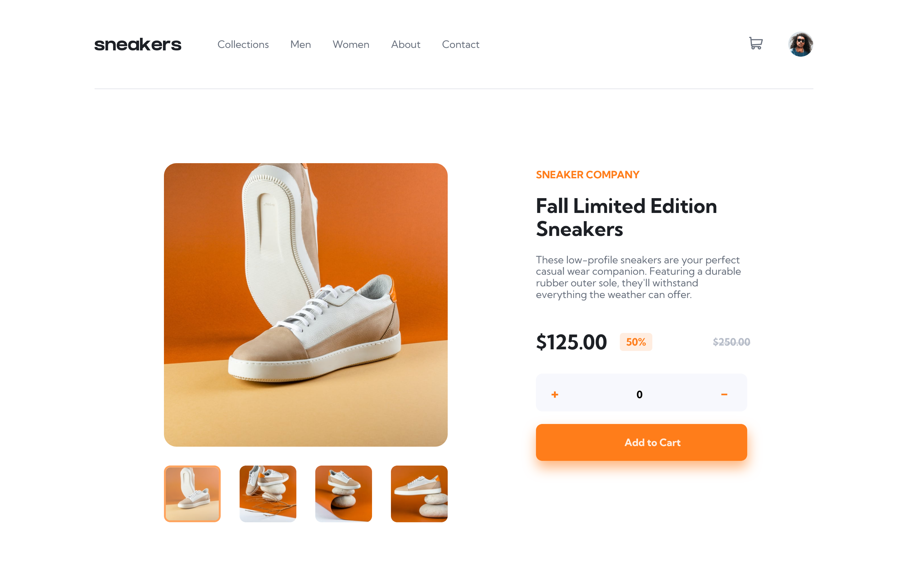

# E-commerce product page - Frontend Mentor Project

## Table of contents

- [Overview](#overview)
  - [The challenge](#the-challenge)
  - [Screenshot](#screenshot)
  - [Links](#links)
- [My process](#my-process)
  - [Built with](#built-with)
  - [Continued development](#continued-development)
- [Author](#author)

## Overview

### The challenge

Users should be able to:

- View the optimal layout for the component depending on their device's screen size
- See hover states for all interactive elements on the page
-Open a lightbox gallery by clicking on the large product image
-Switch the large product image by clicking on the small thumbnail images
-Add items to the cart
-View the cart and remove items from it

### Screenshot

### Links

- Live site URL:  (https://angel2424.github.io/ecommerce_product_page)

## My process

### Built with

- Semantic HTML5 markup
- Sass
- Flexbox
- Vanilla JavaScript

### Continued development

Since the time I finished this project I wanted to take a look at my code and see what I could improve, I think my way of writing HTML and CSS could be more organized, I have since then looked at the BEM method for writing classes to improve specificity and overall making my code look more organized with the help of Sass and BEM together. I have also now looked more into switching from the import rule to use and forward rules in sass, which are better practices. 

## Author

- Website - [Angel Rodriguez](https://angel2424.github.io/portfolio)

- Instagram - [@a.rdzcodes24](https://www.instagram.com/a.rdzcodes24)
